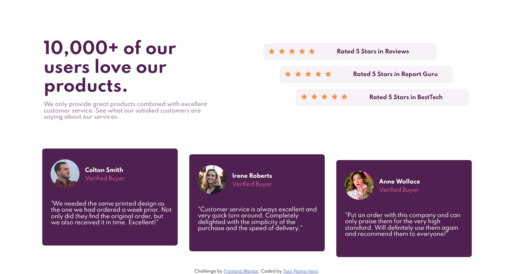
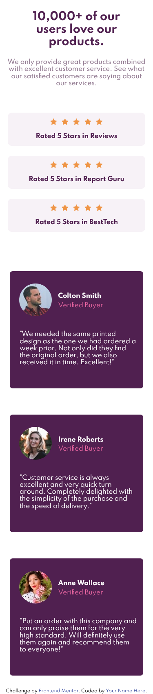

# Frontend Mentor - Social proof section solution

This is a solution to the [Social proof section challenge on Frontend Mentor](https://www.frontendmentor.io/challenges/social-proof-section-6e0qTv_bA). Frontend Mentor challenges help you improve your coding skills by building realistic projects. 

## Table of contents

- [Overview](#overview)
  - [The challenge](#the-challenge)
  - [Screenshot](#screenshot)
  - [Links](#links)
- [My process](#my-process)
  - [Built with](#built-with)
  - [Continued development](#continued-development)
- [Author](#author)

## Overview

### The challenge

Users should be able to:

- View the optimal layout for the section depending on their device's screen size

### Screenshot

This is the Desktop solution view

This is the Mobile solution view

### Links

- Solution URL: [Github repository](https://github.com/ichiklaus/fem-social-proof-section.git)
- Live Site URL: [Live site](https://ichiklaus-fem-social-proof-section.netlify.app/)

## My process

### Built with

- Semantic HTML5 markup
- CSS custom properties
- Flexbox
- Mobile-first workflow
- [Normalize.css](https://github.com/necolas/normalize.css) - For css resets.

### Continued development

Areas I want to focus more are: semantic html, css layout, mobile-first workflow, class reuse.

## Author
- Frontend Mentor - [@ichiklaus](https://www.frontendmentor.io/profile/ichiklaus)
- Twitter - [@ichiklaus](https://www.twitter.com/ichiklaus)
